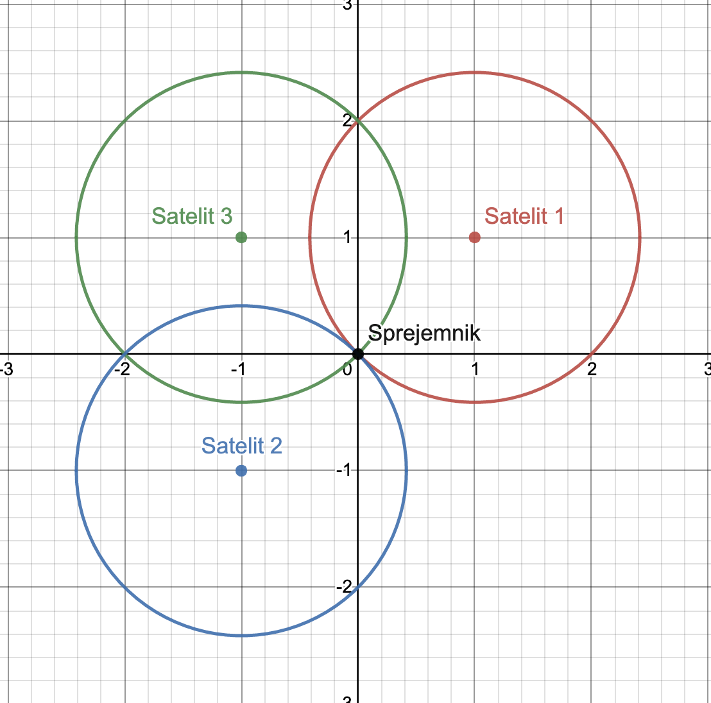
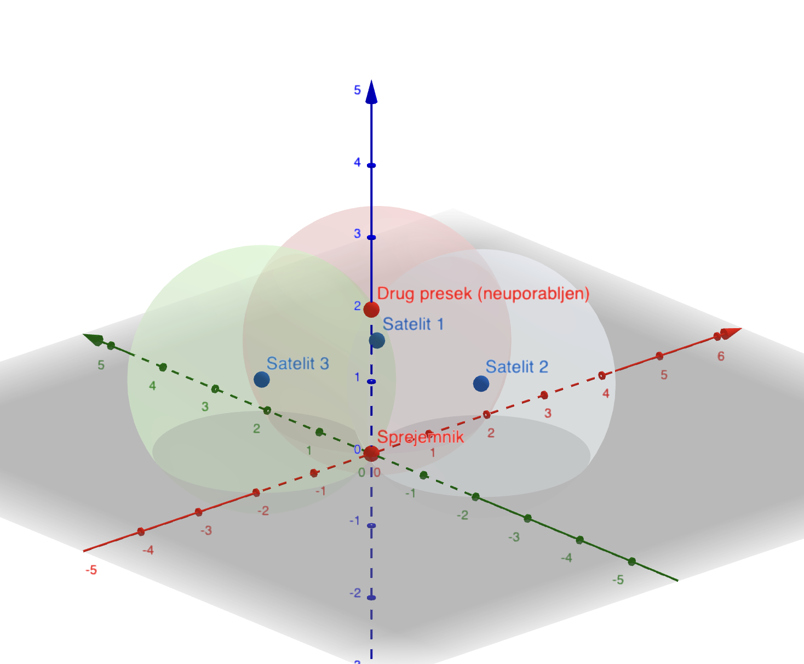
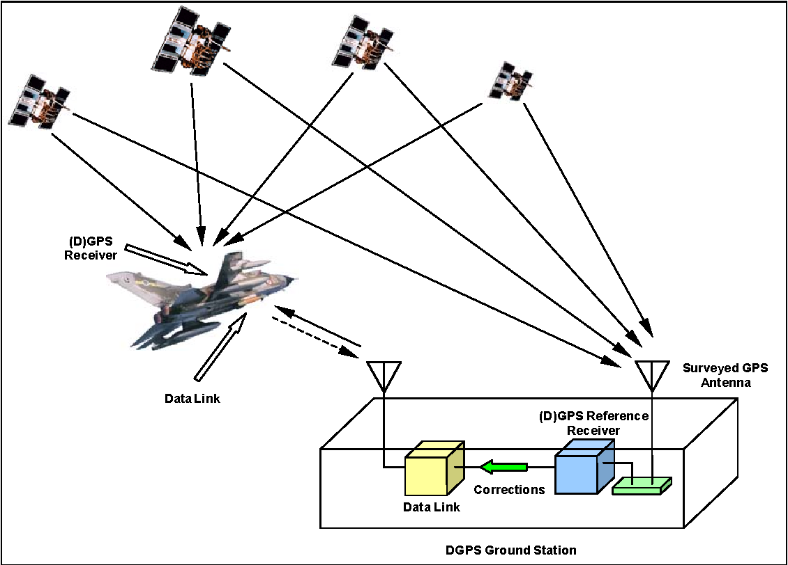

# Kaj je GPS?
Vsi poznamo GPS (Global Positioning System). Uporablja se za lociranje naprav, ki ga podpirajo. Ko govorimo o GPS-u ponavadi mislimo na GNSS (Global navigation satelite system). GNSS je sistem za določanje lokacije s pomočjo več satelitov.
Obstaja več implementacij te tehnologije: 
    -   Ameriški GPS
    -   Ruski GLONASS
    -   Evropski Galileo
    -   Kitajski Beidou
    -   ...

Vsak od teh ima svoje prednosti in slabosti. Vsi imajo manj natančni javni del, ki je namenjen za širšo javnost in natančenjši privatni, namenjen za državne namene. Po natančnosti jih težko razporedimo, saj ima vsak svoje idealne pogoje v katerih je najbolj natančen.


# Kako deluje?

Teoretično potrebujemo za določitev pozicije točke v sistemu razdaljo do treh drugih točk.

Za lociranja neke naprave potrebujemo vsaj 3 satelite. Vsak izmed satelitov izmeri razdaljo do naprave.


Izračun preseka bomo razložili v dveh dimenzijah, ampak se to lepo prenese v tri dimenzije. 

Matematična formula za krožnico je $ (x - x_1)^2 + (y - y_1)^2 = r^r $. Kjer je $ (x_1, y_1) $ središče krožnice, $ r $ pa je polmer. Ko imamo krožnice je z lahkoto izračunati njihov presek.



Ko se pomaknemo v tri-dimenzionalni prostor dobimo iz treh sfer dva preseka. Sateliti v resnici ne zaznavajo povsod okoli sebe, ampak le v smer sprejemnika, zato drugega preseka ne zazna.

V praksi se pojavi problem časovnih zakasnitev. Elektromagnetni valovi ne potujejo naskončno hitro, ampak z svetlobno hitrostjo. S tem pride pri meritvah do napak, zaradi katerih bi bilo lociranje ne natančno. Vsi satelit vsebujejo zelo drage atomične ure z katerimi so sinhronizirani. Problem bi rešili tako, da bi sprejemniki tudi vsebovali atomično, vendar bi bilo to zelo cenovno in energetsko ne ugodno.
V praksi imamo pri lociranju vedno na voljo več kot tri satelite (pet do osem), kar nam omogoča detektiranje napak. 

# Izbolšave GPS
GPS lahko deluje le do enega metra natančno. Zato obstajajo tudi izbolšave.

Primera sta:
- WAAS - "Wide Area Augmentation System"
- DGPS - "Differential GPS"


  
Oba uporablata postaje na površju zemlje, ki omogočajo izbolšave do centimetra natančno, vendar mora biti sprejemnik vedno v dosegu teh postaj.

# Opis naprave (sprejemnik)
### Primer razvojnega modula: GPS NEO-6M
- Podpira STM32
- Načini priklopa:
    - USB
    - UART
    - SPI
 


# Kje se uporablja

Navigacija
Pomoč pri avtonomni vožnji
Droni
IMU
Traktor
Telefon
Vojaški nameni
Sledenje živalim

# Zgodovina

# Demo

Za lažje razumevanje poteka izračuna koordinat nekega sprejemnika s tremi sateliti smo napisali Python program, ki najprej v tri dimenzionalni prostor postavi naključno tri satelite (rdeče sfere s črno obrobo) in en sprejemnik (modra sfera). Nato pa se sprejemnik premika v ravni liniji, sateliti pa z izmerjenimi razdaljami postavi predmet v prostor. Zunanja sfera predstavlja realno pozicijo sprejemnika, zunanja pa izračunano. Kot smo že govorili, sta produkt preseka treh sfer v tri dimenzionalnem prostoru dve točki. Presek izračunamo s funkcijo:
```py
def trilaterate(P1, P2, P3, r1, r2, r3):
    temp1 = P2-P1
    e_x = temp1/norm(temp1)
    temp2 = P3-P1
    i = dot(e_x, temp2)
    temp3 = temp2 - i*e_x
    e_y = temp3/norm(temp3)
    e_z = cross(e_x, e_y)
    d = norm(P2-P1)
    j = dot(e_y, temp2)
    x = (r1*r1 - r2*r2 + d*d) / (2*d)
    y = (r1*r1 - r3*r3 - 2*i*x + i*i + j*j) / (2*j)
    temp4 = r1*r1 - x*x - y*y
    if temp4 < 0:
        raise Exception("The three spheres do not intersect!")
    z = sqrt(temp4)
    p_12_a = P1 + x*e_x + y*e_y + z*e_z
    p_12_b = P1 + x*e_x + y*e_y - z*e_z
    return p_12_a, p_12_b
```
Kot je razvidno, zadeva deluje dobro. V resnici temu ni tako, saj pride do težav pri natančnem merjenju razdalj. V programu merjenje razdalj ni problematično, saj so sateliti popolnoma v sinhronizaciji. V realnem svetu sateliti razdaljo merijo z radijskimi signali (kako dolgo potrebujejo, da pripotujejo do satelita), zato pride pri meritvah do razlik. Imamo pa srečo, da je v zemljini orbiti trenutno postavljenih dovolj satelitov, da imamo na vsakem delču zemljine površine v neki časovni točki na voljo vsaj več satelitov kot tri. S tem si lahko pomagamo, da te napake minimiziramo.

# Sources
https://en.wikipedia.org/wiki/Satellite_navigation#Global_navigation_satellite_systems

https://dewesoft.com/products/interfaces-and-sensors/gps-and-imu-devices

https://www.nasa.gov/directorates/heo/scan/communications/policy/GPS_History.html
