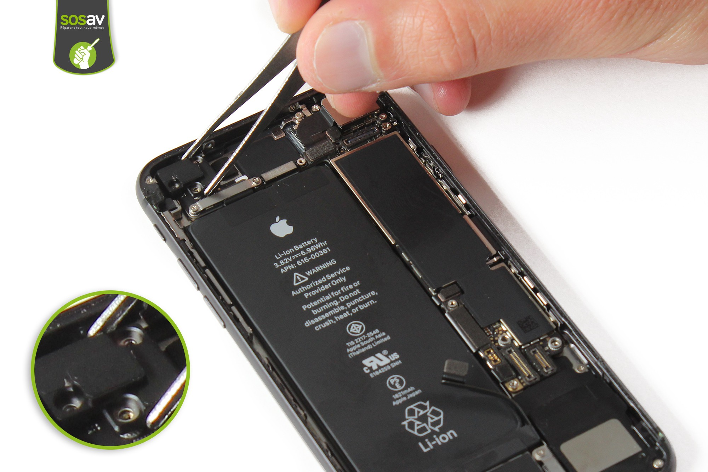
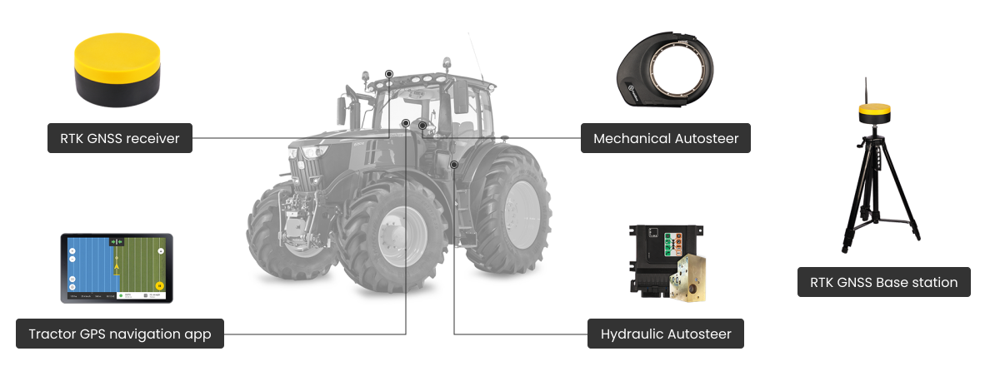
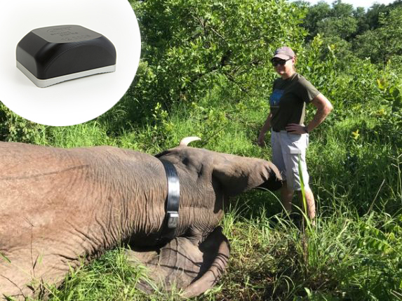

<!DOCTYPE html>
<html>
<head>
<style>
h1 {
    position: absolute;
    top: 35%;
}
#under-title {
    position: absolute;
    top: 45%;
}
img {
    display: block;
    margin-left: auto;
    margin-right: auto;
}
</style>
<link rel="stylesheet" type="text/css" href="mystyle.css">
</head>
<body>

<h1><b>VIN Predavanja – 1. DN 2021/22</b></h1>
<h2 id="under-title">
<ul>
<li>Tema: GPS sprejemniki (navigacija, pozicioniranje)</li>
<li>Avtorji: Mark Loboda, Filip Jeretina, Andrej Sušnik</li>
<li>Datum: 27.3.2022</li>
</ul>
</h2>


</body>
</html>

<div style="page-break-after: always;"></div>

## Kaj je GPS?
Vsi poznamo GPS (Global Positioning System). Uporablja se za lociranje naprav, ki ga podpirajo. Ko govorimo o GPS-u ponavadi mislimo na GNSS (Global navigation satelite system). GNSS je sistem za določanje lokacije s pomočjo več satelitov.
Obstaja več implementacij te tehnologije: 
    -   Ameriški GPS
    -   Ruski GLONASS
    -   Evropski Galileo
    -   Kitajski Beidou
    -   ...

Vsak od teh ima svoje prednosti in slabosti. Vsi imajo manj natančni javni del, ki je namenjen za širšo javnost in natančenjši privatni, namenjen za državne namene. Po natančnosti jih težko razporedimo, saj ima vsak svoje idealne pogoje v katerih je najbolj natančen.


## Kako deluje?

Teoretično potrebujemo za določitev pozicije točke v sistemu razdaljo do treh drugih točk.

Za lociranja neke naprave potrebujemo vsaj 3 satelite. Vsak izmed satelitov izmeri razdaljo do naprave.


Izračun preseka bomo razložili v dveh dimenzijah, ampak se to lepo prenese v tri dimenzije. 

Matematična formula za krožnico je $ (x - x_1)^2 + (y - y_1)^2 = r^r $. Kjer je $ (x_1, y_1) $ središče krožnice, $ r $ pa je polmer. Ko imamo krožnice je z lahkoto izračunati njihov presek.


Ko se pomaknemo v tri-dimenzionalni prostor dobimo iz treh sfer dva preseka. Sateliti v resnici ne zaznavajo povsod okoli sebe, ampak le v smer sprejemnika, zato drugega preseka ne zazna.

V praksi se pojavi problem časovnih zakasnitev. Elektromagnetni valovi ne potujejo naskončno hitro, ampak z svetlobno hitrostjo. S tem pride pri meritvah do napak, zaradi katerih bi bilo lociranje ne natančno. Vsi satelit vsebujejo zelo drage atomične ure z katerimi so sinhronizirani. Problem bi rešili tako, da bi sprejemniki tudi vsebovali atomično, vendar bi bilo to zelo cenovno in energetsko ne ugodno.
V praksi imamo pri lociranju vedno na voljo več kot tri satelite (pet do osem), kar nam omogoča detektiranje napak. 

## Izbolšave GPS
GPS lahko deluje le do enega metra natančno. Zato obstajajo tudi izbolšave.

Primera sta:
- WAAS - "Wide Area Augmentation System"
- DGPS - "Differential GPS"


  
Oba uporablata postaje na površju zemlje, ki omogočajo izbolšave do centimetra natančno, vendar mora biti sprejemnik vedno v dosegu teh postaj.

## Opis naprave (sprejemnik)
### Primer razvojnega modula: GPS NEO-6M
- Podpira STM32
- Načini priklopa:
    - USB
    - UART
    - SPI
 
### Podatkovni format
- Protokol [NMEA (National Marine Electronics Association)](https://en.wikipedia.org/wiki/NMEA_0183) za komunikacijo z GPS sateliti.  
- RTCM [https://en.wikipedia.org/wiki/RTCM_SC-104](https://en.wikipedia.org/wiki/RTCM_SC-104) za komunikacijo med DGPS in receiverjem. 


## Kje se uporablja

### Telefon
Telefoni GPS uporabljajo za lociranje naprave, vendar niso omejeni le na GPS, saj lahko informacijo o lokaciji dobijo tudi iz mobilnega omrežja.
Najpogostejša aplikacije, ki uporabljajo GPS so aplikacije za navigacijo (Apple Maps, Google Maps, Sygnic, ...). Te aplikacije nam lahko povejo našo lokacijo ali pa nam dajo natančna navodila kako priti iz ene lokacije do druge.



### IMU
IMU naprave vsebujejo GPS s katerim zagotavljajo precizno merjenje lokacije, merjenje pospeška in hitrosti.

Primer je DS IMU podjetja Dewesoft, ki je zelo popularen v avtomobilski industriji, kjer se med drugim uporablja za testiranje in validacijo sistemov za avtonomno vožnjo.


### Kmetijski pripomočki
V zadnjih nekaj letih postajajo zelo popularni sistemi za avtonomno vožnjo kmetijskih pripomočkov. Večjo natančnost dosežemo z uporabo baznih postaj, kar nam omogoči uporabo na terenih kjer je natančnost zelo važna (ob rekah, polja nepravilne oblike, ...). Takšni sistemi so zelo popularni v Ameriki, saj je tam kmetovanje veliko bolj industrializirano, kar pomeni, da so polja bolj ravna in večja.


### Vojaški nameni 
Ameriška vojska GPS uporablja v letalih, ladjah, vozilih in pehoti. GPS je vojski omogočil razvoj orožji za avtomatskim ciljanjem, pomoga tudi pri upravljanju brezpilotnih systemov in dostavi surovin na bojišče.


Primer avtonomnega zračnega vozila, ki uporablja GPS za opazovalne misije in nevarne situacije, brez da bi operaterja spravil v nevarnost. To vozilo se je uporabljalo za ogled škode na reaktorju na Japonskem leta 2011 pomaga pa tudi pri odstranjevanju bomb.

### Sledenje živalim
Biologi, raziskovalci in naravovarstvene agencije uporabljajo GPS za oddaljeno opazovanje premikov in migracijskih vzorcev divjih živali. Ponavadi uporabljajo GPS v kombinaciji z več drugimi senzorji in sistemom z avtomatsko nalagane podatkov npr. mobilni podatiki ali GPRS.



## Zgodovina

Začetki satelitske navigacije so se začele leta 1957, ko je Sovjetska zveza izstrelila v orbito satelit Sputnik 1. Za izračun pozicije v orbiti so uporabili meritve, napravljene z eno postajo na zemlji. Nato pa so se domislili, da bi ta isti postopek lahko uporabili obratno za lociranje naprave na zemlji.

Prvi sistem je bil Transit (1964), katerega so uporabljale U.S. Navy ladje in podmornice. Ladje so takrat locirali z nekaj 100 metrsko natančnostjo.


## Demo

Za lažje razumevanje poteka izračuna koordinat nekega sprejemnika s tremi sateliti smo napisali Python program, ki najprej v tri dimenzionalni prostor postavi naključno tri satelite (rdeče sfere s črno obrobo) in en sprejemnik (modra sfera). Nato pa se sprejemnik premika v ravni liniji, sateliti pa z izmerjenimi razdaljami postavi predmet v prostor. Zunanja sfera predstavlja realno pozicijo sprejemnika, zunanja pa izračunano. Kot smo že govorili, sta produkt preseka treh sfer v tri dimenzionalnem prostoru dve točki. Presek izračunamo s funkcijo:
```py
def trilaterate(P1, P2, P3, r1, r2, r3):
    temp1 = P2-P1
    e_x = temp1/norm(temp1)
    temp2 = P3-P1
    i = dot(e_x, temp2)
    temp3 = temp2 - i*e_x
    e_y = temp3/norm(temp3)
    e_z = cross(e_x, e_y)
    d = norm(P2-P1)
    j = dot(e_y, temp2)
    x = (r1*r1 - r2*r2 + d*d) / (2*d)
    y = (r1*r1 - r3*r3 - 2*i*x + i*i + j*j) / (2*j)
    temp4 = r1*r1 - x*x - y*y
    if temp4 < 0:
        raise Exception("The three spheres do not intersect!")
    z = sqrt(temp4)
    p_12_a = P1 + x*e_x + y*e_y + z*e_z
    p_12_b = P1 + x*e_x + y*e_y - z*e_z
    return p_12_a, p_12_b
```
Kot je razvidno, zadeva deluje dobro. V resnici temu ni tako, saj pride do težav pri natančnem merjenju razdalj. V programu merjenje razdalj ni problematično, saj so sateliti popolnoma v sinhronizaciji. V realnem svetu sateliti razdaljo merijo z radijskimi signali (kako dolgo potrebujejo, da pripotujejo do satelita), zato pride pri meritvah do razlik. Imamo pa srečo, da je v zemljini orbiti trenutno postavljenih dovolj satelitov, da imamo na vsakem delču zemljine površine v neki časovni točki na voljo vsaj več satelitov kot tri. S tem si lahko pomagamo, da te napake minimiziramo.

## Viri
https://en.wikipedia.org/wiki/Satellite_navigation#Global_navigation_satellite_systems

https://dewesoft.com/products/interfaces-and-sensors/gps-and-imu-devices

https://oemgnss.trimble.com/the-history-of-the-global-positioning-system/

https://dewesoft.com/products/interfaces-and-sensors/gps-and-imu-devices

https://timeandnavigation.si.edu/satellite-navigation/who-uses-satellite-navigation/military-applications

https://en.wikipedia.org/wiki/GPS_animal_tracking
